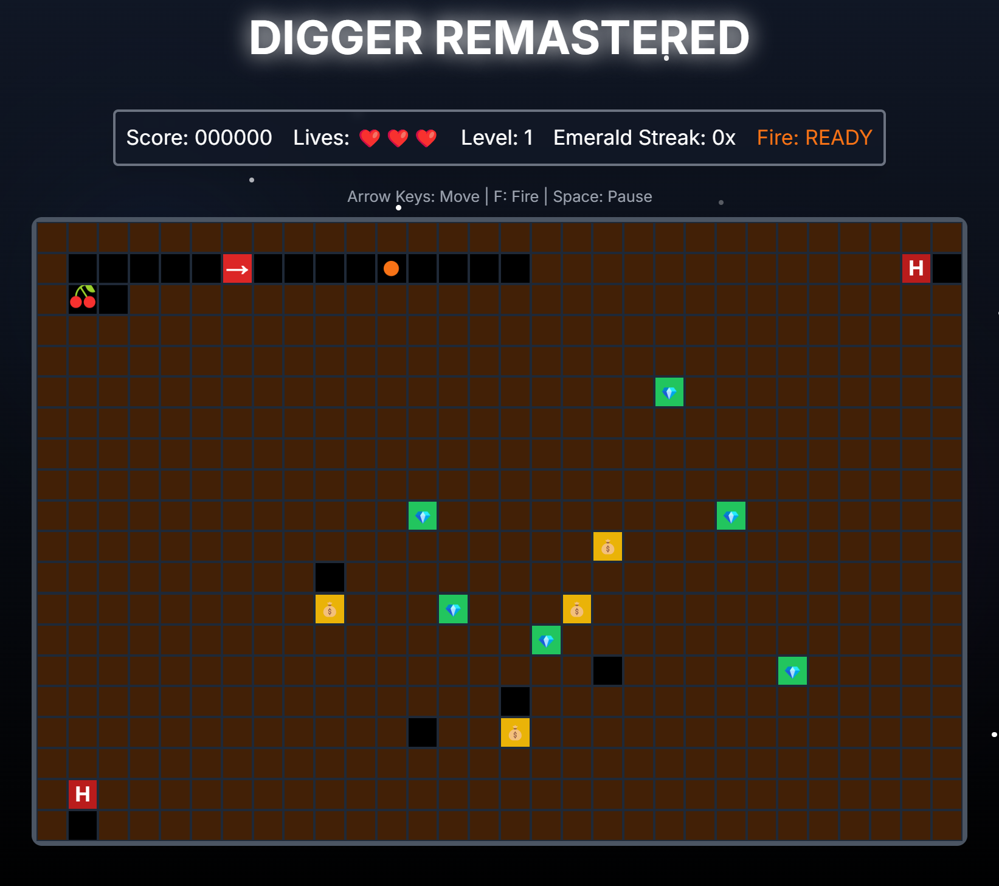

# 🕹️ Digger Remastered

A modern remake of the classic Digger game, rebuilt with React, Next.js, and TypeScript. Dig tunnels, collect emeralds, avoid enemies, and watch out for falling gold bags!



## 🎮 Game Overview

Digger Remastered is a recreation of the classic 1983 Windmill Software game. You control the Digger through an underground maze filled with emeralds, while avoiding enemies and falling gold bags.

## ✨ Features

- **🎮 Classic Gameplay**: Navigate mazes, collect treasures, and avoid enemies
- **🌟 Visual Effects**: Particle effects and screen shake for immersive feedback
- **🌀 Teleport Portals**: Warp between different parts of the maze
- **🔥 Combat**: Fire projectiles to defend against enemies
- **💎 Gold & Emeralds**: Collect valuables for points, with combo multipliers for consecutive emeralds
- **🍒 Power Mode**: Collect cherries for temporary invincibility
- **⚡ Levels System**: Progressive difficulty with more enemies and obstacles
- **💀 Enemies**: Nobbins that transform into more dangerous Hobbins over time

## 🚀 Getting Started

### Prerequisites

- Node.js 14.x or higher
- npm or yarn

### Installation

1. Clone the repository:
   ```bash
   git clone https://github.com/ca-vahid/digger.git
   cd digger
   ```

2. Install dependencies:
   ```bash
   npm install
   # or
   yarn install
   ```

3. Install required packages:
   ```bash
   npm install framer-motion use-sound
   # or
   yarn add framer-motion use-sound
   ```

4. Start the development server:
   ```bash
   npm run dev
   # or
   yarn dev
   ```

5. Open [http://localhost:3000](http://localhost:3000) in your browser to play the game.

## 🎯 How to Play

- **Arrow Keys**: Move the Digger
- **F Key**: Fire (shoot projectiles)
- **Space**: Pause/Resume game

### Game Elements:

- **💎 Emeralds**: Collect all to complete the level. Consecutive emeralds increase point value.
- **💰 Gold Bags**: Can be pushed horizontally. Will fall through tunnels and break if they fall too far.
- **💰 Gold Nuggets**: Appear when gold bags break, collect for bonus points.
- **🍒 Cherries**: Collect for temporary power mode (invincibility).
- **🌀 Portals**: Step on them to teleport to another location.
- **👾 Enemies**:
  - **Nobbins (N)**: Move through tunnels randomly.
  - **Hobbins (H)**: Evolved form of Nobbins that actively pursue you.

## 🛠️ Technologies Used

- **React** - UI Library
- **Next.js** - React Framework
- **TypeScript** - For type safety
- **Framer Motion** - For animations and effects
- **Tailwind CSS** - For styling

## 🎨 Game Design

The game features a procedurally generated level system that increases in difficulty as you progress:
- More emeralds and gold bags in higher levels
- Additional enemies that spawn more frequently
- Nobbins transform into Hobbins more quickly
- Higher chance for enemies to start as the more dangerous Hobbin type

## 🧠 Game Mechanics

- **Gold Bag Physics**: Bags fall through empty spaces and break if they fall more than one square
- **Enemy AI**: Nobbins wander randomly, while Hobbins actively pursue the player
- **Combo System**: Consecutive emerald collection increases point values
- **Power Mode**: Temporary invincibility and ability to defeat enemies by touching them

## 📝 Future Enhancements

- Mobile touch controls
- High score leaderboard
- Sound effects and background music
- Additional enemy types from the original game
- Custom level editor
- Multiplayer support

## 📜 License

This project is licensed under the MIT License - see the LICENSE file for details.

## 🙏 Acknowledgements

- Original Digger game by Windmill Software
- The React, Next.js, and TypeScript communities
- Framer Motion for the animation library

---

Enjoy playing Digger Remastered! Feel free to contribute to this project by submitting issues or pull requests. 